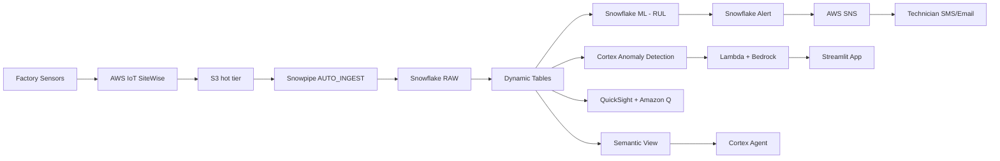

# Predictive Maintenance & Equipment Intelligence

AI-powered predictive maintenance for industrial equipment — detect anomalies before they become failures, predict remaining useful life, and auto-generate work orders. Powered by **Snowflake** (Dynamic Tables, ML Model Registry, Cortex AI) and **AWS** (IoT SiteWise, S3, Snowpipe, SNS, Lambda, Bedrock, QuickSight).

## Architecture



## Snowflake Capabilities

| Capability | Object | Detail |
|-----------|--------|--------|
| Dynamic Tables | EQUIPMENT_HEALTH, ANOMALY_ALERTS, MAINTENANCE_SCHEDULE, RUL_PREDICTIONS | 1-5 min lag, auto-refresh |
| Snowflake ML | ML.RUL_PREDICTOR (Model Registry) | XGBoost RUL model, warehouse inference |
| ML Functions | ANOMALY_DETECTION | Time-series anomaly on vibration data |
| Cortex Search | MAINTENANCE_DOCS_SEARCH | Full-text search on maintenance procedures |
| Semantic View | MAINTENANCE_ANALYTICS_VIEW | Natural language analytics |
| Cortex Agent | MAINTENANCE_AGENT | Orchestrates Analyst + Search + Charts |
| Snowpipe | SENSOR_REALTIME_PIPE | AUTO_INGEST from S3 via SQS |
| Alert | CRITICAL_EQUIPMENT_ALERT | Fires every 5 min on health < 20 |
| Streamlit | PREDICTIVE_MAINTENANCE_APP | 8-page dashboard |

## AWS Services

| Service | Component | Purpose |
|---------|-----------|---------|
| IoT SiteWise | 100 assets, 3 plants, 8 lines | Digital twin of factory floor |
| S3 | maintenance/realtime/ prefix | Sensor data landing zone |
| SNS | mfg-maintenance-critical-alerts | Technician alert notifications |
| Lambda | mfg-maint-workorder-bedrock | Bedrock work order generator |
| Bedrock | Claude Sonnet 4.6 | Structured work order generation |
| QuickSight | 2 dashboards + Amazon Q topics | Executive reporting |

## Personas

| Persona | Role | Key Questions |
|---------|------|---------------|
| **Tom Anderson** | Plant Manager | Which equipment needs attention now? What's my exposure? |
| **Lisa Chang** | VP Operations | What's our unplanned downtime costing us? How to reduce it? |

## Data

| Table | Rows | Description |
|-------|------|-------------|
| EQUIPMENT | 100 | Asset registry with specifications |
| SENSOR_READINGS | 200,000 | IoT telemetry (vibration, temperature, pressure, current, RPM) |
| SENSOR_READINGS_REALTIME | ~500+ | Real-time Snowpipe-ingested sensor data |
| WORK_ORDERS | 5,000 | Maintenance history and scheduling |
| FAILURE_HISTORY | 500 | Past failures with root cause and cost |
| MAINTENANCE_DOCS | 100 | Procedures, manuals, and safety protocols |
| RUL_PREDICTIONS (DT) | 100 | ML predicted days-to-failure per equipment |
| PLANT_HIERARCHY | 100 | SiteWise plant/line/equipment mapping |

## Build Instructions

### Prerequisites
- Snowflake account with ACCOUNTADMIN access
- Cortex AI enabled (ML Functions, Search, Agent)
- Warehouse: CORTEX (Medium)

### Core Snowflake (works standalone)

```bash
snowsql -f snowflake/00_setup.sql
snowsql -f snowflake/01_raw_tables.sql
snowsql -f snowflake/02_staging.sql
snowsql -f snowflake/03_dynamic_tables.sql
snowsql -f snowflake/04_search.sql
snowsql -f snowflake/05_ml_models.sql
snowsql -f snowflake/06_semantic_view.sql
snowsql -f snowflake/07_agent.sql
```

### AWS Integrations (optional)

See [aws/README.md](aws/README.md) for detailed step-by-step AWS setup.

```bash
snowsql -f snowflake/08_sitewise_workorder.sql
snowsql -f snowflake/09_snowpipe_s3.sql
snowsql -f snowflake/10_iot_sitewise.sql
snowsql -f snowflake/11_snowflake_ml.sql
snowsql -f snowflake/12_sns_alerts.sql
```

### ML Model Training (optional)

```bash
pip install snowflake-ml-python xgboost scikit-learn
SNOWFLAKE_CONNECTION_NAME=<connection> python scripts/train_rul_model.py
```

### Streamlit App

```
MANUFACTURING_MAINTENANCE.APP.PREDICTIVE_MAINTENANCE_APP
```

8 pages: Overview, Equipment Health, Anomaly Alerts, ML Predictions, Maintenance Schedule, Real-Time Ingestion, AI Work Order, Ask Maintenance

## Key Demo Numbers

- **Air Compressor 21** — health 10/100, OFFLINE, 4 critical sensors (worst in fleet)
- **12 equipment** at IMMINENT failure risk (<7 days predicted)
- **161 active anomaly alerts**, 13 already breached
- **$36M** maintenance backlog at risk
- **100 assets** across 3 plants, 8 production lines
- **5 AWS services** in one closed-loop pipeline

## License

Apache 2.0 — See [LICENSE](LICENSE) for details.
This is a personal project and is not an official Snowflake offering. It comes with no support or warranty. Use it at your own risk. Snowflake has no obligation to maintain, update, or support this code. Do not use this code in production without thorough review and testing.
