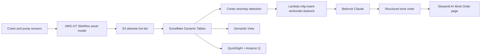

# Predictive Maintenance & Equipment Intelligence

AI-powered predictive maintenance for industrial equipment — detect anomalies before they become failures, powered by Snowflake Cortex AI.

## Architecture

An industrial AI maintenance co-pilot built on **Snowflake** (Dynamic Tables, ML.ANOMALY_DETECTION, semantic view, Cortex Analyst, Cortex Complete) and **AWS** (IoT SiteWise, S3, Lambda, Bedrock, QuickSight + Amazon Q). SiteWise watches the sensors; Snowflake catches the anomaly; Bedrock writes the work order with parts, skills, ETA, and safety notes — one click for the technician.




## Personas

| Persona | Role | Key Questions |
|---------|------|---------------|
| **Tom Anderson** | Plant Manager | Which equipment needs attention now? What's my exposure? |
| **Lisa Chang** | VP Operations | What's our unplanned downtime costing us? How to reduce it? |

## Data

| Table | Rows | Description |
|-------|------|-------------|
| EQUIPMENT | 100 | Asset registry with specifications |
| SENSOR_READINGS | 200,000 | IoT telemetry (vibration, temperature, pressure) |
| WORK_ORDERS | 5,000 | Maintenance history and scheduling |
| FAILURE_HISTORY | 500 | Past failures with root cause and cost |
| MAINTENANCE_DOCS | 100 | Procedures, manuals, and safety protocols |

## Build Instructions

### Prerequisites
- Snowflake account with ACCOUNTADMIN access
- Cortex AI enabled (ML Functions, Search, Agent)
- Warehouse: CORTEX (Medium)

### Deployment

```bash
snowsql -f snowflake/00_setup.sql
snowsql -f snowflake/01_raw_tables.sql
snowsql -f snowflake/02_staging.sql
snowsql -f snowflake/03_dynamic_tables.sql
snowsql -f snowflake/04_search.sql
snowsql -f snowflake/05_ml_models.sql
snowsql -f snowflake/06_semantic_view.sql
snowsql -f snowflake/07_agent.sql
```

### Streamlit App
```
MANUFACTURING_MAINTENANCE.APP.PREDICTIVE_MAINTENANCE_APP
```

## Key Demo Numbers

- **Crane 7** — vibration at 5.6 mm/s (threshold: 6.0)
- **26 hours** until predicted failure
- **$2.3M** average crane failure cost
- **Reefer 12** — temperature drifting, secondary alert
- **100 assets** monitored across the facility

## License

Apache 2.0 — See [LICENSE](LICENSE) for details.
This is a personal project and is not an official Snowflake offering. It comes with no support or warranty. Use it at your own risk. Snowflake has no obligation to maintain, update, or support this code. Do not use this code in production without thorough review and testing.
